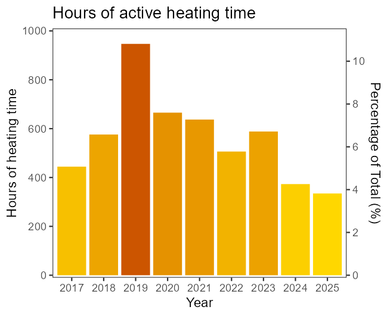
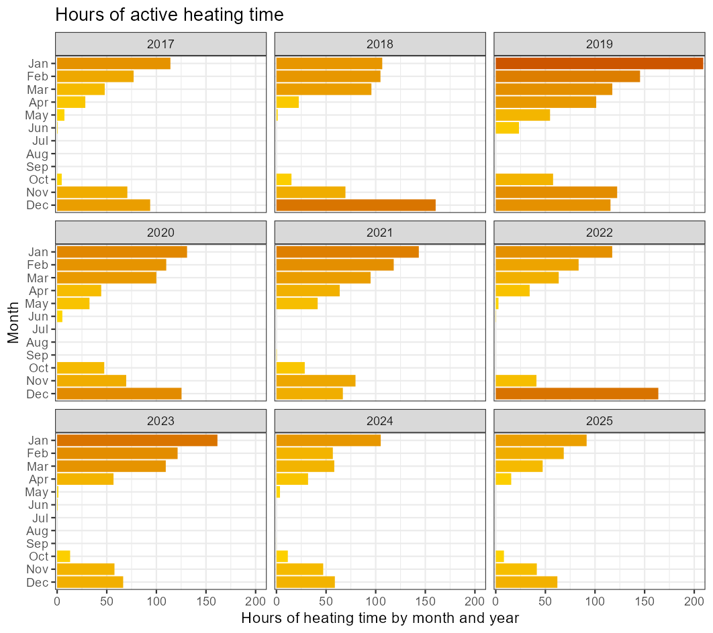
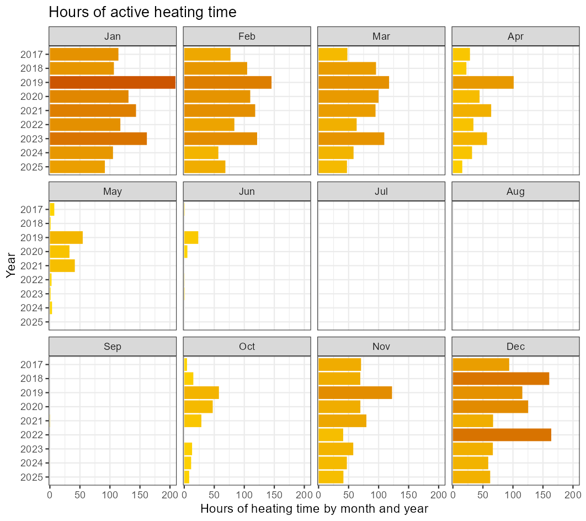
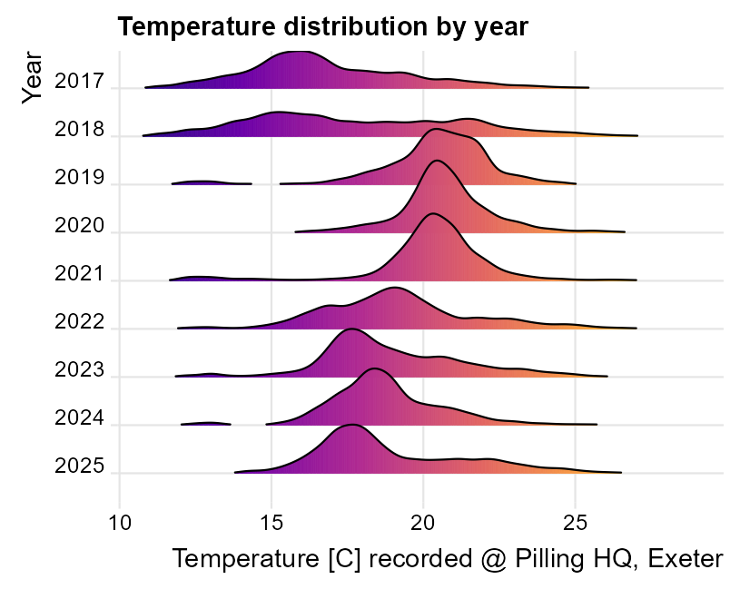
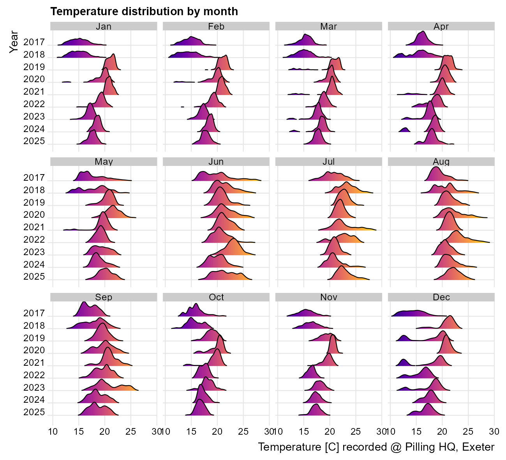
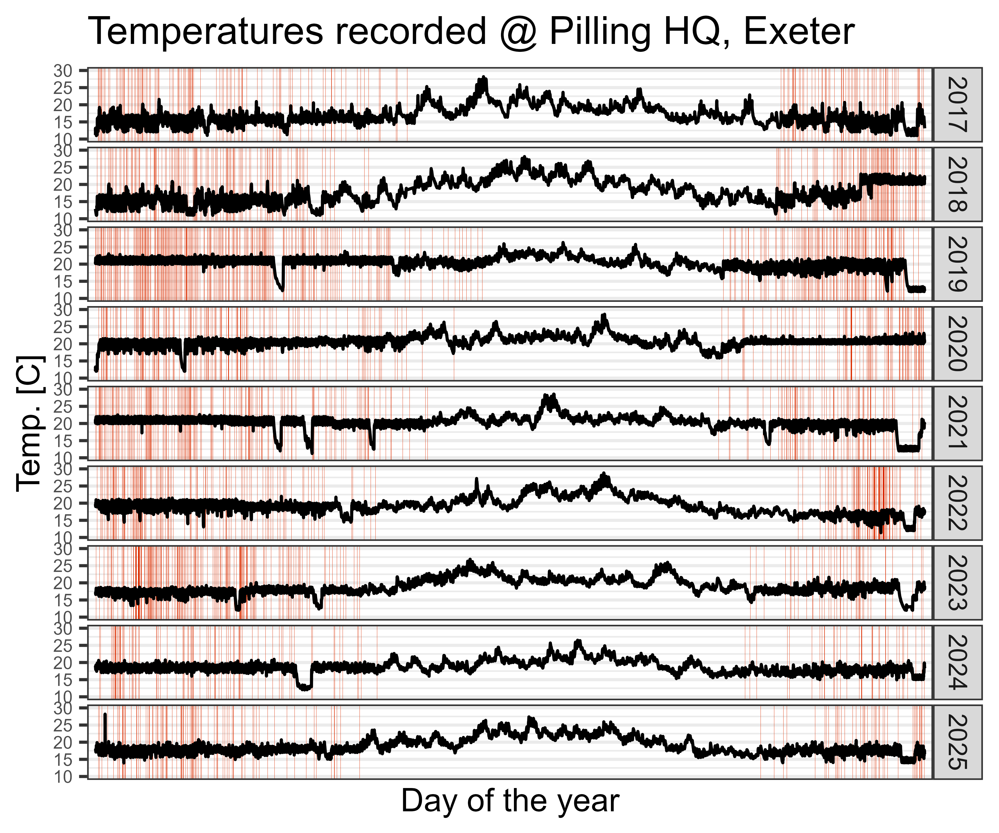
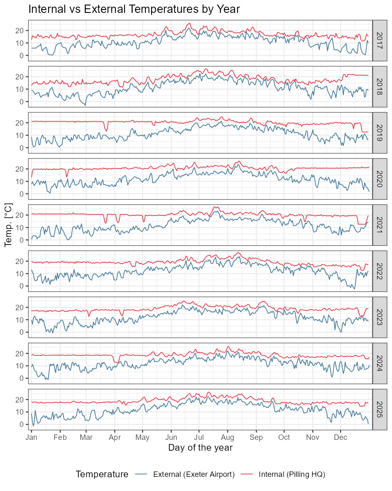
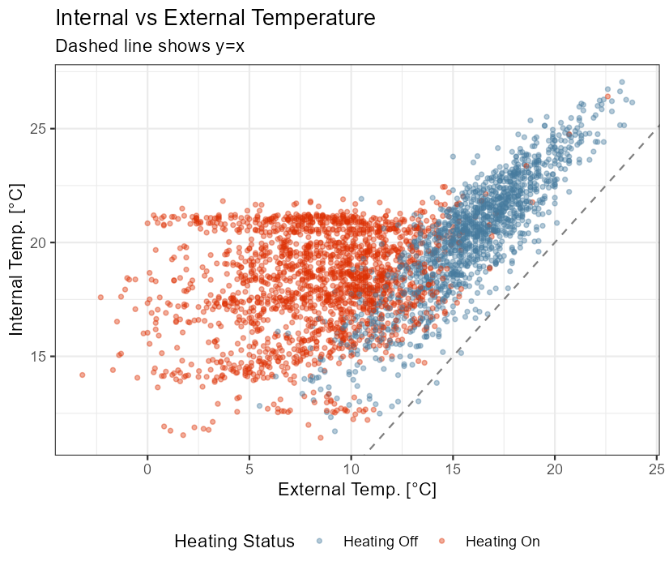
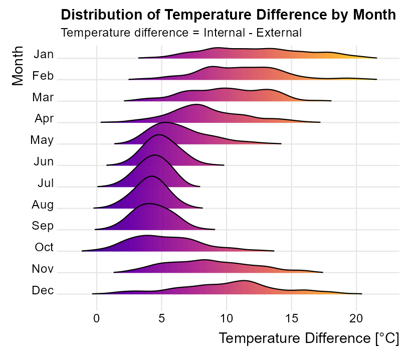
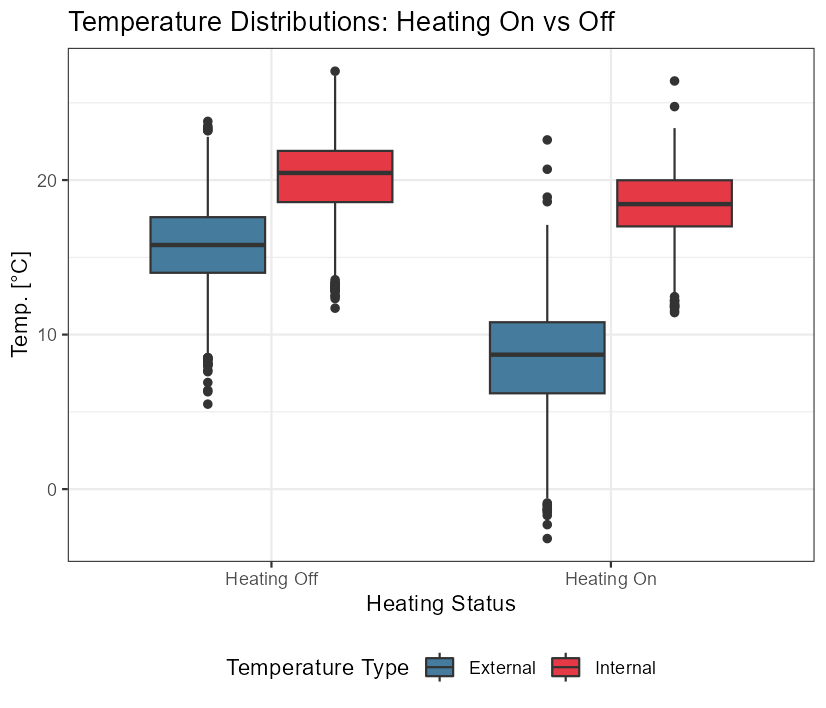

# Heating data from my Raspberry Pi

## Specs

Raspberry Pi 1 Model B, revision 2.0

Equipped with a 700MHz ARM processor and 512 MB RAM..

Purchased Jan 2013. Installed as central heating controller in Nov 2016. Run smoothly ever since.

# Summary and statistics

Date range included in analyses: 1 Jan 2017 to 31 Dec 2025

 - Total heating hours = 5,072
 - % of all hours = 6.4% (of 78,864)
 - Mean and SD heating period duration = 0.61 (0.47)
 - Month with most heating hours = Jan 2019 (209 hours, 28% of total)

# Hours of active heating time

# Temperature distributions

# Temperatures by day with heating time 

# Comparisons to external temperatures

Weather data from https://meteostat.net/en/place/gb/exeter?s=03839&t=2017-01-01/2025-12-31

Average temperature per day at the nearest climate station (Exeter Airport)

